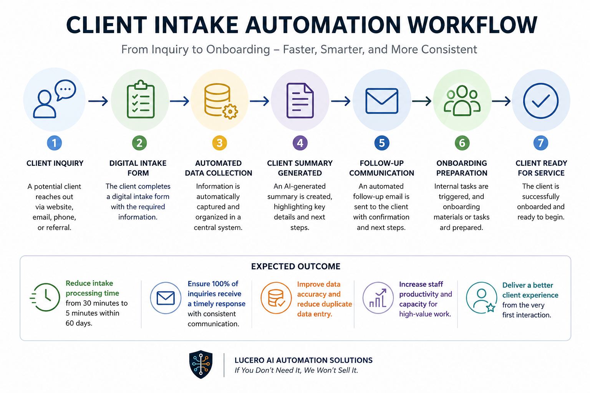

# Client Intake Automation Workflow

## Outcome

Reduce client intake processing time from 30 minutes to 5 minutes within 60 days while improving response consistency and onboarding efficiency.

## Overview

This project demonstrates how a small business or nonprofit organization can automate the client intake process to reduce administrative work, improve response times, and create a more consistent onboarding experience.

The workflow is designed to eliminate repetitive data entry, standardize communication, and accelerate the transition from initial inquiry to client onboarding.

---

## Business Challenge

Many organizations rely on manual intake processes that require staff to:

- Collect information through email or phone calls
- Enter data into spreadsheets or databases
- Prepare intake summaries
- Draft follow-up emails
- Coordinate onboarding activities

These repetitive tasks create delays, increase administrative workload, and introduce opportunities for error.

---

## Solution

The Client Intake Automation Workflow streamlines the intake process by automatically collecting, organizing, and distributing information needed to begin client engagement.

### Workflow

Client Inquiry

↓

Digital Intake Form

↓

Automated Data Collection

↓

Client Summary Generated

↓

Follow-Up Communication

↓

Onboarding Preparation

↓

Client Ready for Service

---

## Expected Outcome

### Administrative Efficiency

Reduce client intake processing time from 30 minutes to 5 minutes within 60 days.

### Faster Response Times

Provide consistent follow-up communication immediately after inquiry submission.

### Improved Data Quality

Reduce duplicate data entry and improve information accuracy.

### Better Client Experience

Create a more professional and consistent onboarding process.

---

## Technology Examples

This workflow could be implemented using technologies such as:

- Microsoft Forms
- Google Forms
- Airtable
- Microsoft Power Automate
- Zapier
- OpenAI
- CRM Platforms

Technology selection depends on organizational requirements and existing systems.

---

## Business Impact

Organizations implementing automated intake workflows can:

- Reduce administrative workload
- Improve onboarding consistency
- Accelerate client response times
- Improve data quality
- Increase staff capacity for higher-value activities

---

## Who This Helps

- Nonprofit Organizations
- Educational Programs
- Professional Services Firms
- Real Estate Professionals
- Churches
- Small Businesses

---

## Consulting Approach

Lucero AI Automation Solutions follows a trust-based approach:

> If You Don't Need It, We Won't Sell It.

The objective is to identify the simplest solution that delivers measurable business results without unnecessary software, subscriptions, or complexity.

---

## Project Status

Portfolio Demonstration Project

This project demonstrates a practical business automation workflow and is intended as an example of how client intake processes can be redesigned to improve operational efficiency.
